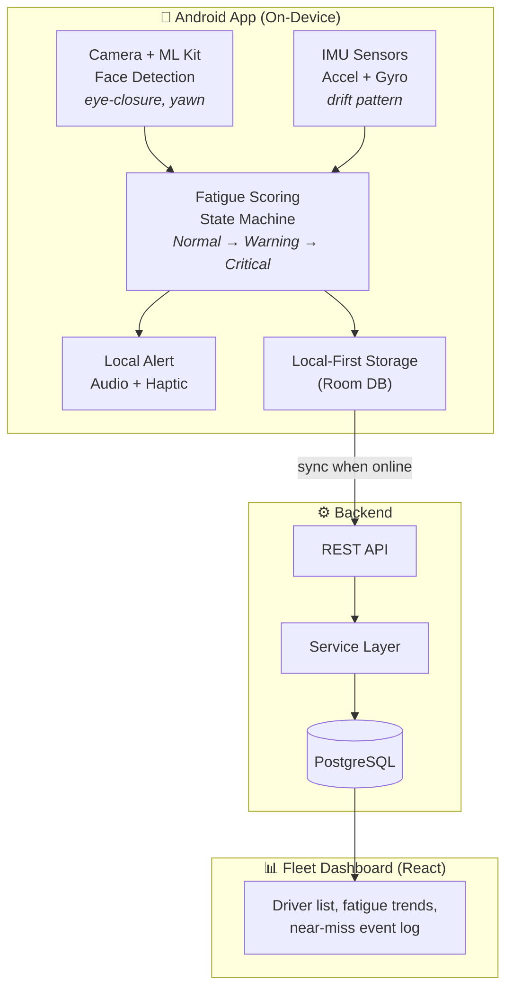
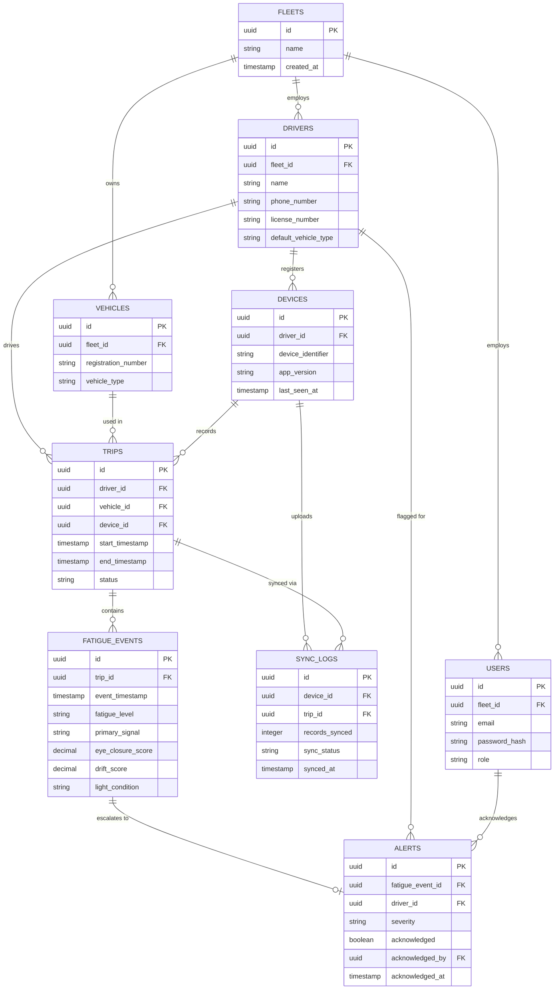
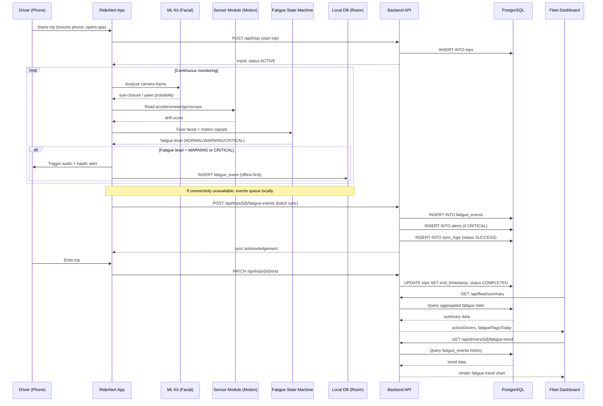

# RideAlert
### Smartphone-Based Multi-Signal Driver Fatigue Detection & Fleet Safety Platform

**Submitted to:** Tata Technologies InnoVent 2027 — AI at the Edge Solutions for Automotive (3.2.1.1 — Edge AI for ADAS and Autonomous Systems)

---

## 1. Problem Statement

Driver fatigue is a leading, preventable contributor to road fatalities in India. This risk is concentrated in the two segments least protected by existing safety technology:

- **Two-wheeler riders** — the majority of vehicles on Indian roads, and the group accounting for roughly 31% of all road injury fatalities nationally (Global Burden of Disease study).
- **Commercial truck drivers** — particularly those on long overnight hauls, where fatigue risk compounds over hours of monotonous driving.

India recorded over 4.5 lakh road accidents resulting in nearly 1.7 lakh deaths in 2022 (Ministry of Road Transport and Highways). Research on sleepiness-related crashes attributes 10–30% of fatal accidents and up to 42.5% of near-miss accidents to drowsiness.

### Why existing solutions fall short

**OEM-grade driver monitoring systems** (Bosch, Seeing Machines, Smart Eye) are technically mature but:
- Require dedicated infrared camera hardware costing thousands of dollars
- Are integrated only into premium passenger vehicles
- Are structurally inaccessible to two-wheelers and small/mid-size trucking fleets

**Consumer smartphone apps** (e.g., DriveSafe Drowsiness Detector) and **academic/open-source prototypes**:
- Detect eye closure or yawning using a single camera-based signal only
- Operate as single-device, single-driver tools with no fleet visibility
- Have no motion-based fallback for low-light/night conditions
- Have been explicitly flagged in prior research as lacking fleet-level features and external validation

**The gap:** There is no accessible, multi-signal, fleet-aware fatigue detection solution for the two-wheeler and commercial trucking segments — despite these being the highest-risk, most underserved categories in driver safety today.

---

## 2. Proposed Solution — Overview

RideAlert is an Android application that turns a driver's existing smartphone into a fatigue-monitoring device, with zero incremental hardware cost, plus a backend and dashboard layer that gives fleet operators visibility they currently don't have.

### Core innovation: dual-signal fusion
Rather than relying on camera-based eye tracking alone (which degrades in low light — precisely when fatigue incidents concentrate), RideAlert fuses two independent signals:

1. **Facial signal** — eye-closure duration and yawning, via on-device computer vision
2. **Motion signal** — steering/handlebar micro-drift patterns, via phone accelerometer and gyroscope

These feed into a **graduated fatigue-scoring state machine** (Normal → Early Warning → Critical) instead of a single fixed threshold, reducing false positives and the "alarm fatigue" that causes drivers to ignore binary alert systems. In low-light conditions, the motion signal becomes the primary indicator, directly addressing the night-driving blind spot every existing solution leaves unsolved.

### Fleet layer (the second core differentiator)
Trip-level fatigue scores and near-miss events sync to a backend whenever connectivity is available, feeding an operator dashboard that shows fatigue trends per driver over time — converting fleet fatigue management from reactive (post-incident) to visible and trackable.

---

## 3. System Architecture

### 3.1 High-level component diagram



### 3.2 Detection pipeline detail (ASCII — for quick terminal/README reference)

```
 CAMERA FEED                    IMU STREAM
     |                              |
     v                              v
+-----------+                +--------------+
| ML Kit     |                | Accel/Gyro    |
| Face       |                | Drift          |
| Detection  |                | Detector       |
+-----+-----+                +------+-------+
      |                              |
      |   eye-closure / yawn         |   drift score
      |   probability                |
      +--------------+---------------+
                     |
                     v
          +-----------------------+
          |  Fatigue State Machine  |
          |  NORMAL -> WARNING ->    |
          |  CRITICAL                |
          +-----------+-----------+
                      |
        +-------------+-------------+
        |                           |
        v                           v
 +-------------+           +-------------------+
 | Audio +      |           | Room DB            |
 | Haptic Alert |           | (trip/event log)   |
 +-------------+           +---------+---------+
                                      |
                          sync when connectivity available
                                      v
                          +-----------------------+
                          |  Backend REST API       |
                          +-----------------------+
```

### 3.3 Component responsibilities

| Component | Responsibility |
|---|---|
| Android App | On-device detection, fusion, alerting, local storage, sync |
| ML Kit Face Detection | Real-time eye-closure & yawn signal from camera feed |
| Sensor Module | Accelerometer/gyroscope-based drift detection |
| Fatigue State Machine | Fuses both signals into a single graduated risk level |
| Local Storage (Room) | Offline-first persistence of trips/events before sync |
| Backend API | Ingests trip/event data, exposes data to dashboard |
| Database (PostgreSQL) | Persists drivers, trips, fatigue events |
| Fleet Dashboard (React) | Visualizes fatigue trends for fleet operators |

---

## 4. Directory Structure

### 4.1 Android App (`ridealert-android/`)

Following package-by-feature structure:

```
ridealert-android/
├── app/
│   ├── src/main/java/com/teamdebuggers/ridealert/
│   │   ├── detection/
│   │   │   ├── facial/
│   │   │   │   ├── FaceDetectionAnalyzer.kt
│   │   │   │   └── EyeStateTracker.kt
│   │   │   ├── motion/
│   │   │   │   ├── MotionSensorListener.kt
│   │   │   │   └── DriftPatternDetector.kt
│   │   │   └── fusion/
│   │   │       ├── FatigueStateMachine.kt
│   │   │       └── FatigueLevel.kt (enum: NORMAL, WARNING, CRITICAL)
│   │   ├── alerting/
│   │   │   ├── AlertManager.kt
│   │   │   ├── AudioAlertPlayer.kt
│   │   │   └── HapticAlertController.kt
│   │   ├── service/
│   │   │   └── FatigueMonitoringService.kt (foreground service)
│   │   ├── data/
│   │   │   ├── local/
│   │   │   │   ├── AppDatabase.kt (Room)
│   │   │   │   ├── TripDao.kt
│   │   │   │   └── FatigueEventDao.kt
│   │   │   ├── remote/
│   │   │   │   ├── RideAlertApi.kt (Retrofit interface)
│   │   │   │   └── SyncWorker.kt (WorkManager for background sync)
│   │   │   └── model/
│   │   │       ├── Trip.kt
│   │   │       └── FatigueEvent.kt
│   │   ├── ui/
│   │   │   ├── monitoring/
│   │   │   │   ├── MonitoringActivity.kt
│   │   │   │   └── MonitoringViewModel.kt
│   │   │   └── history/
│   │   │       ├── TripHistoryActivity.kt
│   │   │       └── TripHistoryViewModel.kt
│   │   └── RideAlertApplication.kt
│   └── src/main/AndroidManifest.xml
├── app/src/test/java/... (unit tests, mirrors main package structure)
├── app/src/androidTest/java/... (instrumented/UI tests)
└── build.gradle.kts
```

### 4.2 Backend — Option A: Spring Boot (`ridealert-backend/`)

```
ridealert-backend/
├── src/main/java/com/teamdebuggers/ridealert/
│   ├── driver/
│   │   ├── Driver.java (entity)
│   │   ├── DriverRepository.java
│   │   ├── DriverService.java
│   │   └── DriverController.java
│   ├── trip/
│   │   ├── Trip.java (entity)
│   │   ├── TripRepository.java
│   │   ├── TripService.java
│   │   ├── TripController.java
│   │   └── dto/
│   │       ├── TripRequestDto.java
│   │       └── TripResponseDto.java
│   ├── fatigueevent/
│   │   ├── FatigueEvent.java (entity)
│   │   ├── FatigueEventRepository.java
│   │   ├── FatigueEventService.java
│   │   ├── FatigueEventController.java
│   │   └── dto/
│   │       └── FatigueEventDto.java
│   ├── fleet/
│   │   ├── FleetSummaryService.java
│   │   └── FleetController.java (aggregated dashboard endpoints)
│   ├── config/
│   │   ├── SecurityConfig.java
│   │   └── CorsConfig.java
│   └── RideAlertApplication.java
├── src/main/resources/
│   ├── application.yml
│   └── db/migration/ (Flyway scripts)
│       ├── V1__create_drivers_table.sql
│       ├── V2__create_trips_table.sql
│       └── V3__create_fatigue_events_table.sql
├── src/test/java/... (JUnit 5 + Mockito unit tests, mirrors main package structure)
└── pom.xml
```

### 4.3 Backend — Option B: Node.js (`ridealert-backend-node/`)

An alternative backend implementation, useful if the team prefers a JS-only stack across backend and dashboard, or wants faster iteration for the MVP.

```
ridealert-backend-node/
├── src/
│   ├── modules/
│   │   ├── driver/
│   │   │   ├── driver.model.js       (Sequelize/Prisma model)
│   │   │   ├── driver.repository.js
│   │   │   ├── driver.service.js
│   │   │   ├── driver.controller.js
│   │   │   └── driver.routes.js
│   │   ├── trip/
│   │   │   ├── trip.model.js
│   │   │   ├── trip.repository.js
│   │   │   ├── trip.service.js
│   │   │   ├── trip.controller.js
│   │   │   └── trip.routes.js
│   │   ├── fatigueEvent/
│   │   │   ├── fatigueEvent.model.js
│   │   │   ├── fatigueEvent.repository.js
│   │   │   ├── fatigueEvent.service.js
│   │   │   ├── fatigueEvent.controller.js
│   │   │   └── fatigueEvent.routes.js
│   │   └── fleet/
│   │       ├── fleet.service.js
│   │       └── fleet.controller.js
│   ├── config/
│   │   ├── db.js
│   │   └── cors.js
│   ├── middleware/
│   │   └── errorHandler.js
│   ├── migrations/ (Knex/Prisma migration files)
│   ├── app.js
│   └── server.js
├── tests/
│   ├── unit/ (Jest — mirrors src/modules structure)
│   └── integration/ (Supertest — API-level tests)
├── package.json
└── .env.example
```

**Stack for Node option:** Express.js (routing), Prisma or Sequelize (ORM for PostgreSQL), Jest + Supertest (testing).

**Choosing between them:** Spring Boot aligns with your existing Java/DSA background and gives stronger typing/structure for a team new to backend work; Node.js lets you share JS/TS knowledge with the React dashboard and iterate faster if the team is more comfortable in JavaScript. Pick one before Phase 0 ends — don't build both in parallel.

### 4.4 Fleet Dashboard (`ridealert-dashboard/`)

```
ridealert-dashboard/
├── src/
│   ├── features/
│   │   ├── drivers/
│   │   │   ├── DriverList.jsx
│   │   │   ├── DriverDetail.jsx
│   │   │   └── useDrivers.js
│   │   ├── trips/
│   │   │   ├── TripHistory.jsx
│   │   │   └── useTrips.js
│   │   ├── fatigue-events/
│   │   │   ├── FatigueEventLog.jsx
│   │   │   ├── FatigueTrendChart.jsx
│   │   │   └── useFatigueEvents.js
│   │   └── dashboard/
│   │       ├── DashboardOverview.jsx
│   │       └── SummaryCards.jsx
│   ├── api/
│   │   └── client.js (Axios instance)
│   ├── components/ (shared UI components)
│   ├── App.jsx
│   └── main.jsx
├── tests/ (Vitest + React Testing Library, mirrors src/features structure)
├── package.json
└── vite.config.js
```

---

## 5. Feature List

### 5.1 Android App

| Feature | Description | Priority |
|---|---|---|
| Camera-based eye/yawn detection | ML Kit Face Detection running on live camera feed | Must-have (MVP) |
| Motion-based drift detection | Accelerometer/gyroscope pattern analysis for steering drift | Must-have (MVP) |
| Fatigue state machine | Fuses both signals into Normal/Warning/Critical levels | Must-have (MVP) |
| Audio + haptic alerting | Escalating alerts tied to fatigue state | Must-have (MVP) |
| Foreground service | Keeps monitoring active while app is backgrounded | Must-have (MVP) |
| Local-first storage | Persists trip/event data offline (Room DB) | Must-have (MVP) |
| Background sync | Syncs stored data to backend when connectivity available | Must-have (MVP) |
| Trip history view | Driver can review their own past trips/fatigue events | Nice-to-have |
| Low-light mode indicator | UI shows when system has switched to motion-primary detection | Nice-to-have |
| Battery optimization prompt | Guides user to exempt app from battery optimization | Must-have (MVP) |

### 5.2 Backend

| Feature | Description | Priority |
|---|---|---|
| Driver registration/management | CRUD for driver profiles | Must-have (MVP) |
| Trip ingestion endpoint | Accepts trip start/end + metadata from app | Must-have (MVP) |
| Fatigue event ingestion endpoint | Accepts individual fatigue events per trip | Must-have (MVP) |
| Fleet summary endpoint | Aggregated stats for dashboard (active drivers, flags today) | Must-have (MVP) |
| Per-driver fatigue trend endpoint | Historical fatigue data for trend charts | Must-have (MVP) |
| Authentication | Basic auth or JWT for driver/operator identity | Nice-to-have (stretch) |

### 5.3 Fleet Dashboard

| Feature | Description | Priority |
|---|---|---|
| Driver list view | List of all drivers with current fatigue status | Must-have (MVP) |
| Fatigue trend chart | Per-driver fatigue score over time | Must-have (MVP) |
| Near-miss event log | Chronological list of flagged fatigue events | Must-have (MVP) |
| Summary cards | Active drivers, fatigue flags today, etc. | Must-have (MVP) |
| Trip history view | Full trip log per driver | Nice-to-have |

### 5.4 Future Enhancements (explicitly out of MVP scope)
- IR camera accessory (clip-on) for true night-mode facial detection accuracy
- Heart-rate/physiological signal integration via wearables
- Automated fleet scheduling recommendations based on fatigue trends
- Voice-based fatigue cues (slurred speech detection)
- iOS version

---

## 6. Tech Stack

| Layer | Technology |
|---|---|
| Mobile App | Android (Kotlin), CameraX, Room, WorkManager, Retrofit |
| Facial Detection | Google ML Kit Face Detection API (on-device) |
| Motion Signal | Native Android Sensor APIs (accelerometer, gyroscope) |
| Backend (Option A) | Spring Boot (Java 21), Spring Data JPA, JUnit 5, Mockito |
| Backend (Option B) | Node.js, Express.js, Prisma/Sequelize, Jest, Supertest |
| Database | PostgreSQL, Flyway (Spring option) or Prisma/Knex migrations (Node option) |
| Fleet Dashboard | React, Vite, Axios, Recharts (charting), Vitest + React Testing Library |
| API Testing | Bruno |
| IDE | IntelliJ IDEA (Spring Boot) / VS Code (Node), Android Studio (app) |
| Version Control | Git, Conventional Commits |
| OS (dev environment) | Pop!_OS Linux |

---

## 7. API Contract (Draft — backend-agnostic)

These endpoints apply whether the team chooses Spring Boot or Node.js — only the implementation differs.

### `POST /api/trips`
Starts a new trip.
```json
// Request
{
  "driverId": "uuid",
  "startTimestamp": "2026-07-15T20:00:00Z",
  "vehicleType": "TWO_WHEELER" // or "TRUCK"
}
// Response
{
  "tripId": "uuid",
  "status": "ACTIVE"
}
```

### `PATCH /api/trips/{tripId}/end`
Ends an active trip.
```json
{
  "endTimestamp": "2026-07-15T21:30:00Z"
}
```

### `POST /api/trips/{tripId}/fatigue-events`
Logs a fatigue event during a trip.
```json
{
  "timestamp": "2026-07-15T20:45:00Z",
  "fatigueLevel": "CRITICAL", // NORMAL | WARNING | CRITICAL
  "primarySignal": "MOTION", // FACIAL | MOTION | BOTH
  "lightCondition": "LOW" // NORMAL | LOW
}
```

### `GET /api/fleet/summary`
Returns aggregated dashboard stats.
```json
{
  "activeDrivers": 14,
  "fatigueFlagsToday": 3
}
```

### `GET /api/drivers/{driverId}/fatigue-trend`
Returns historical fatigue data for charting.
```json
{
  "driverId": "uuid",
  "trend": [
    { "date": "2026-07-14", "avgFatigueScore": 1 },
    { "date": "2026-07-15", "avgFatigueScore": 2 }
  ]
}
```

*(This contract is a starting draft — finalize field names/types with the whole team before Phase 1 begins, since both Android and backend work depend on it.)*

---

## 8. Database Schema (Complete Design)

Three tables (drivers/trips/fatigue_events) is enough for a bare detection demo, but not for an actual fleet product — there's no way to group drivers under an operator, no vehicle record, no dashboard login, and no visibility into whether phone-to-backend sync is actually working in the field. The complete schema below adds that layer.

### 8.1 Tables overview

| Table | Purpose |
|---|---|
| `fleets` | An operator organization (a trucking company, a delivery fleet) that owns drivers and vehicles |
| `users` | Dashboard login accounts — fleet operators/admins who view the data |
| `drivers` | Individual drivers, belonging to a fleet |
| `vehicles` | Vehicles belonging to a fleet, assignable to drivers |
| `devices` | The phone/app installation registered to a driver, running detection |
| `trips` | A single drive session, tied to driver + vehicle + device |
| `fatigue_events` | Individual fatigue detections logged during a trip |
| `alerts` | Operator-facing flagged events derived from fatigue_events, with acknowledgment tracking |
| `sync_logs` | Records each sync batch from a device, for debugging offline-first reliability |

### 8.2 Full SQL schema

```sql
CREATE TABLE fleets (
    id UUID PRIMARY KEY DEFAULT gen_random_uuid(),
    name VARCHAR(255) NOT NULL,
    created_at TIMESTAMP DEFAULT now()
);

CREATE TABLE users (
    id UUID PRIMARY KEY DEFAULT gen_random_uuid(),
    fleet_id UUID REFERENCES fleets(id),
    email VARCHAR(255) NOT NULL UNIQUE,
    password_hash VARCHAR(255) NOT NULL,
    role VARCHAR(20) NOT NULL DEFAULT 'OPERATOR', -- OPERATOR | ADMIN
    created_at TIMESTAMP DEFAULT now()
);

CREATE TABLE drivers (
    id UUID PRIMARY KEY DEFAULT gen_random_uuid(),
    fleet_id UUID REFERENCES fleets(id),
    name VARCHAR(255) NOT NULL,
    phone_number VARCHAR(20),
    license_number VARCHAR(50),
    default_vehicle_type VARCHAR(20) NOT NULL, -- TWO_WHEELER | TRUCK
    created_at TIMESTAMP DEFAULT now()
);

CREATE TABLE vehicles (
    id UUID PRIMARY KEY DEFAULT gen_random_uuid(),
    fleet_id UUID REFERENCES fleets(id),
    registration_number VARCHAR(50) NOT NULL UNIQUE,
    vehicle_type VARCHAR(20) NOT NULL, -- TWO_WHEELER | TRUCK
    created_at TIMESTAMP DEFAULT now()
);

CREATE TABLE devices (
    id UUID PRIMARY KEY DEFAULT gen_random_uuid(),
    driver_id UUID REFERENCES drivers(id),
    device_identifier VARCHAR(255) NOT NULL UNIQUE, -- Android device/install ID
    app_version VARCHAR(20),
    last_seen_at TIMESTAMP,
    created_at TIMESTAMP DEFAULT now()
);

CREATE TABLE trips (
    id UUID PRIMARY KEY DEFAULT gen_random_uuid(),
    driver_id UUID REFERENCES drivers(id),
    vehicle_id UUID REFERENCES vehicles(id),
    device_id UUID REFERENCES devices(id),
    start_timestamp TIMESTAMP NOT NULL,
    end_timestamp TIMESTAMP,
    status VARCHAR(20) NOT NULL DEFAULT 'ACTIVE', -- ACTIVE | COMPLETED
    created_at TIMESTAMP DEFAULT now()
);

CREATE TABLE fatigue_events (
    id UUID PRIMARY KEY DEFAULT gen_random_uuid(),
    trip_id UUID REFERENCES trips(id),
    event_timestamp TIMESTAMP NOT NULL,
    fatigue_level VARCHAR(20) NOT NULL, -- NORMAL | WARNING | CRITICAL
    primary_signal VARCHAR(20) NOT NULL, -- FACIAL | MOTION | BOTH
    eye_closure_score DECIMAL(4,3), -- nullable, populated when facial signal active
    drift_score DECIMAL(4,3), -- nullable, populated when motion signal active
    light_condition VARCHAR(20) NOT NULL DEFAULT 'NORMAL', -- NORMAL | LOW
    created_at TIMESTAMP DEFAULT now()
);

CREATE TABLE alerts (
    id UUID PRIMARY KEY DEFAULT gen_random_uuid(),
    fatigue_event_id UUID REFERENCES fatigue_events(id),
    driver_id UUID REFERENCES drivers(id),
    severity VARCHAR(20) NOT NULL, -- WARNING | CRITICAL
    acknowledged BOOLEAN NOT NULL DEFAULT FALSE,
    acknowledged_by UUID REFERENCES users(id),
    acknowledged_at TIMESTAMP,
    created_at TIMESTAMP DEFAULT now()
);

CREATE TABLE sync_logs (
    id UUID PRIMARY KEY DEFAULT gen_random_uuid(),
    device_id UUID REFERENCES devices(id),
    trip_id UUID REFERENCES trips(id),
    records_synced INTEGER NOT NULL DEFAULT 0,
    sync_status VARCHAR(20) NOT NULL, -- SUCCESS | PARTIAL | FAILED
    synced_at TIMESTAMP DEFAULT now()
);
```

### 8.3 Entity-Relationship Diagram



### 8.4 Design notes
- `eye_closure_score` and `drift_score` are both nullable on `fatigue_events` since only one signal may be active at a given moment (e.g., low light → motion-only), but storing both when available lets you later analyze how well the two signals agree.
- `alerts` is kept separate from `fatigue_events` rather than merged, because alerts carry operator workflow state (acknowledged/by whom/when) that has nothing to do with the detection event itself — keeping them separate avoids polluting raw detection data with dashboard interaction state.
- `sync_logs` exists specifically because "does offline-first sync actually work reliably in the field" is a real risk area (per Phase 4 testing) — having a table to inspect sync history is what lets you debug it after the fact instead of only trusting the happy path.
- `devices` is separate from `drivers` (rather than a single `device_id` column on `drivers`) because a driver could reinstall the app or switch phones — this keeps device history intact without losing driver identity.

---

## 9. Sequence Diagram — Fatigue Detection to Dashboard Flow

This traces one full cycle: a trip starting, a fatigue event being detected and escalated, and that data reaching the fleet dashboard.



---

## 10. Implementation Plan (with Testing per Phase)

### Phase 0 — Contract & Setup (2–3 days)
**Build:**
- Finalize API contract (Section 7) and DB schema (Section 8) as a team
- Choose backend option (Spring Boot vs Node.js) — don't build both
- Repo setup: package-by-feature structure, Conventional Commits
- Each person scaffolds their own empty project

**Testing:**
- No functional tests yet — instead, validate the contract itself: walk through each endpoint as a team and confirm every field needed by the Android app and dashboard is present
- Set up the test framework skeleton for each track now (JUnit/Mockito or Jest/Supertest for backend, Android instrumented test setup, Vitest for dashboard) so Phase 1 onward has tests from day one, not bolted on later

### Phase 1 — Core Detection Loop (~1–1.5 weeks)
**Build:**
- Camera permission flow → ML Kit Face Detection wired up → foreground service
- Accelerometer/gyroscope listener → standalone drift-pattern logic

**Testing:**
- Unit tests for `EyeStateTracker` and `DriftPatternDetector` logic using recorded/mocked sensor input (no need for a live camera in CI)
- Manual device testing: verify eye-closure detection triggers correctly across a few real faces/lighting conditions
- Manual sensor testing: simulate normal vs. drifting motion patterns and confirm the drift detector flags correctly
- **Milestone:** eye-closure detection working live on a phone; IMU data logging independently, both with basic unit test coverage

### Phase 2 — Fatigue Fusion + Alerting (~3–4 days)
**Build:**
- Graduated state machine (Normal → Warning → Critical)
- Audio + vibration alerts tied to state transitions

**Testing:**
- Unit tests for `FatigueStateMachine` covering all state transitions, including edge cases (e.g., signal conflicting — camera says normal, motion says critical)
- Instrumented test confirming alert triggers fire correctly per state
- Manual test: simulate sustained eye closure and drift together, confirm escalation timing feels right (not too twitchy, not too slow)
- **Milestone:** phone alerts escalate correctly on simulated eye-closure/drift, verified by both automated state-machine tests and manual device runs

### Phase 3 — Backend + Dashboard (parallel to Phase 1–2)
**Build:**
- REST API matching the Phase 0 contract (Spring Boot or Node.js)
- PostgreSQL schema + migrations
- Basic React dashboard: driver list + fatigue trend view

**Testing:**
- Unit tests for service-layer logic (fatigue aggregation, trend calculation)
- Integration tests hitting real endpoints against a test database (JUnit+Testcontainers, or Supertest+test DB)
- Manual API testing via Bruno for every endpoint in the contract
- Component tests for dashboard views (Vitest + React Testing Library) using mocked API responses
- **Milestone:** API accepts a POST from Bruno; dashboard displays it; core endpoints covered by integration tests

### Phase 4 — Integration (~3–4 days)
**Build:**
- Android app syncs trip/event data to backend (local-first, sync on connectivity)
- End-to-end test: phone detects fatigue → logs event → dashboard shows it

**Testing:**
- End-to-end manual test: run the full pipeline on one real device with the backend running locally, confirm data appears correctly on the dashboard
- Test offline behavior explicitly: trigger fatigue events with connectivity off, confirm local storage holds them, then confirm sync fires correctly once connectivity returns
- Regression pass on Phase 1–3 unit/integration tests to confirm nothing broke during integration
- **Milestone:** full pipeline works on one real device, offline-to-online sync verified explicitly

### Phase 5 — Polish + Demo Prep (~2–3 days)
**Build:**
- Bug fixes, UI cleanup
- Record the actual demo video (a known gap from the InnoVent round-1 submission)
- Prepare pitch walkthrough

**Testing:**
- Full manual run-through of the demo script itself before recording, to catch any last-mile bugs
- Final regression pass across all automated tests (backend + app) to confirm a clean, stable state going into the demo

---

## 11. Known Limitations (MVP Scope)

- **Night-mode facial detection** relies entirely on the motion signal fallback for the MVP; a dedicated IR accessory is scoped as a future enhancement, not solved in this phase.
- **No physical prototype** — this is a pure software solution running on commodity smartphones.
- **Single-platform (Android only)** for MVP; iOS is future scope.
- **Authentication is minimal/stretch** for MVP — production deployment would need proper driver/operator identity and access control.
